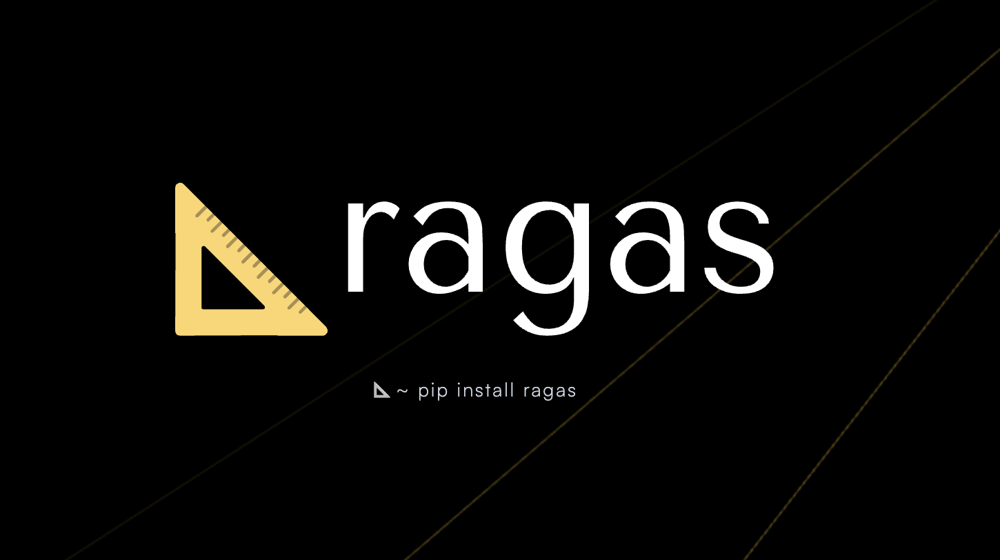

# RAG Evaluation with RAGAS 

A comprehensive evaluation framework for Retrieval-Augmented Generation (RAG) systems using RAGAS metrics. This project demonstrates how to build, test, and evaluate a RAG pipeline using LangChain, OpenAI, Pinecone, and RAGAS.

## 📖 Overview

This project evaluates a RAG system built on "The Ember & Oak Kitchen" restaurant profile. It measures various aspects of RAG performance including:

- **Context Precision**: How relevant is the retrieved context?
- **Context Recall**: Did we retrieve all necessary information?
- **Entity Recall**: Are key entities captured in the context?
- **Noise Sensitivity**: Is the system robust to irrelevant information?
- **Response Relevancy**: How relevant are the generated responses?
- **Faithfulness**: Are responses grounded in the retrieved context?

## 🚀 Features

- ✅ Complete RAG pipeline with LangChain and OpenAI GPT-4
- ✅ Vector storage with Pinecone for efficient retrieval
- ✅ PDF document processing and chunking
- ✅ Comprehensive evaluation with 6 RAGAS metrics
- ✅ Test dataset with ground truth answers
- ✅ Jupyter notebook for interactive exploration

## 📋 Prerequisites

- Python 3.13 or higher
- OpenAI API key
- Pinecone API key
- uv package manager (recommended) or pip

## 🔧 Installation

### 1. Clone the repository

```bash
git clone <your-repo-url>
cd ragas_eval
```

### 2. Install dependencies

**Using uv (recommended):**

```bash
# Install uv if you don't have it
curl -LsSf https://astral.sh/uv/install.sh | sh

# Install dependencies
uv sync
```

**Using pip:**

```bash
# Create a virtual environment
python -m venv .venv
source .venv/bin/activate  # On Windows: .venv\Scripts\activate

# Install dependencies
pip install -r requirements.txt
```

### 3. Set up environment variables

Create a `.env` file in the project root with your API keys:

```env
OPENAI_API_KEY=your_openai_api_key_here
PINECONE_API_KEY=your_pinecone_api_key_here
```

**How to get API keys:**

- **OpenAI API Key**: Sign up at https://platform.openai.com/ and create an API key
- **Pinecone API Key**: Sign up at https://www.pinecone.io/ and get your API key from the dashboard

## 🎮 Usage

### Running the Jupyter Notebook (Recommended)

1. Start Jupyter:

```bash
# If using uv
uv run jupyter notebook

# If using pip
jupyter notebook
```

2. Open `eval.ipynb` in your browser

3. Run cells sequentially:
   - **Cell 0**: Import libraries and load environment variables
   - **Cell 1**: Build the RAG pipeline and set up Pinecone
   - **Cell 2**: Test the RAG chain with a sample query
   - **Cell 3**: Prepare the evaluation dataset
   - **Cell 4**: Run RAGAS evaluation (takes 3-5 minutes)


## 📁 Project Structure

```
ragas_eval/
├── eval.ipynb                              # Main evaluation notebook
├── data.py                                 # Test questions with ground truth
├── The_Ember_and_Oak_Kitchen_Profile.pdf  # Source document
├── pyproject.toml                          # Project dependencies
├── .env                                    # API keys (create this)
└── README.md                               # This file
```

## 📊 Understanding the Metrics

The evaluation uses 6 RAGAS metrics:

| Metric | Description | What it Measures |
|--------|-------------|------------------|
| **LLM Context Precision** | Evaluates if retrieved chunks are relevant | Retrieval quality |
| **LLM Context Recall** | Checks if all necessary info was retrieved | Retrieval completeness |
| **Context Entity Recall** | Verifies key entities are in context | Entity coverage |
| **Noise Sensitivity** | Tests robustness to irrelevant context | System resilience |
| **Response Relevancy** | Measures if response answers the question | Generation quality |
| **Faithfulness** | Ensures response is grounded in context | Factual accuracy |

## 🎯 Customizing for Your Use Case

### Using Your Own Documents

1. Replace `The_Ember_and_Oak_Kitchen_Profile.pdf` with your PDF
2. Update the file path in Cell 1 of `eval.ipynb`:
3. Create your own dataset in `data.py`

```python
loader = PyPDFLoader("your_document.pdf")
```

### Adding Your Own Test Questions

Edit `data.py` to add your questions and ground truth answers:

```python
examples = [
    {
        "question": "Your question here?",
        "ground_truth": "The expected answer based on your document.",
    },
    # Add more examples...
]
```

### Adjusting Retrieval Parameters

In Cell 1 of `eval.ipynb`, modify:

```python
# Change number of retrieved chunks (default: 3)
retriever = vectorstore.as_retriever(search_kwargs={"k": 5})

# Adjust chunk size and overlap
text_splitter = RecursiveCharacterTextSplitter(
    chunk_size=1500,   # Increase for larger chunks
    chunk_overlap=300  # Increase for more context preservation
)
```

### Changing the LLM Model

In Cell 1, update the model:

```python
# Use a different OpenAI model
Model = init_chat_model("gpt-4o-mini", temperature=0.6)  # Faster, cheaper
Model = init_chat_model("gpt-4-turbo", temperature=0.6)   # More powerful
```

## 🐛 Troubleshooting

### Common Issues

**1. "Index is empty" message**

The first run will create and populate the Pinecone index. This is normal and expected.

**2. Timeout errors during evaluation**

Some metrics may timeout. This is usually not critical. The evaluation will continue with other metrics.

**3. "API key not found" errors**

Ensure your `.env` file is in the project root and contains valid API keys.

**4. Memory issues**

If running out of memory, reduce the number of examples in `data.py` or decrease `chunk_size`.

**5. Pinecone dimension mismatch**

If you change the embedding model, delete the old index from Pinecone dashboard or use a new index name.

## 📈 Expected Results

After running the evaluation, you'll see metrics like:

```
llm_context_precision_without_reference: 0.79
context_recall: 0.77
context_entity_recall: 0.85
noise_sensitivity: 0.82
response_relevancy: 0.88
faithfulness: 0.91
```

**Good scores** are typically:
- 0.7-0.8: Acceptable
- 0.8-0.9: Good
- 0.9+: Excellent

## 🔄 Next Steps

- Experiment with different chunk sizes and overlap
- Try different embedding models
- Add more test questions
- Test with different LLM models
- Fine-tune prompts for better responses
- Export results to CSV for analysis

## 📚 Resources

- [RAGAS Documentation](https://docs.ragas.io/)
- [LangChain Documentation](https://python.langchain.com/)
- [Pinecone Documentation](https://docs.pinecone.io/)
- [OpenAI API Documentation](https://platform.openai.com/docs/)

## 📝 License

This project is open source and available for educational purposes.

## 🤝 Contributing

Feel free to fork this repository and customize it for your needs. If you find bugs or have suggestions, please open an issue.

---
**Created with ❤️ for learning**   
**Happy Evaluating! 🚀**

